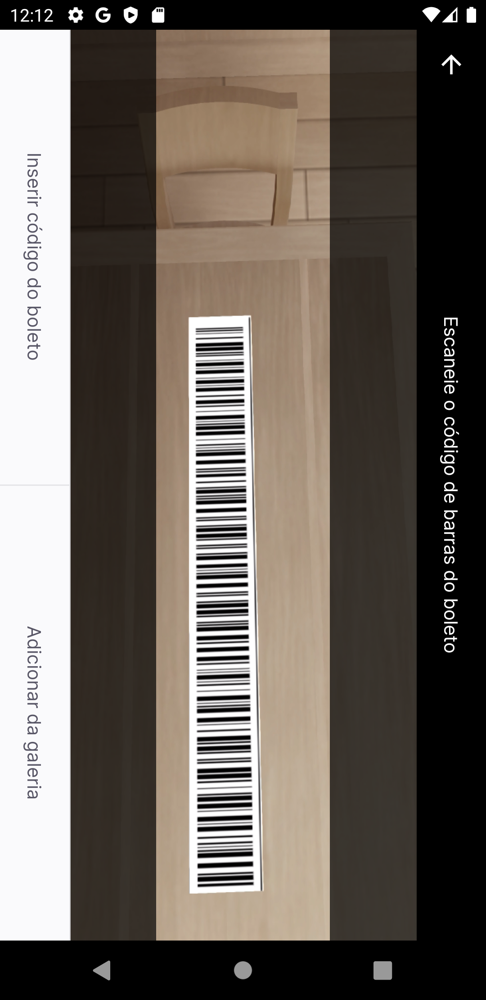
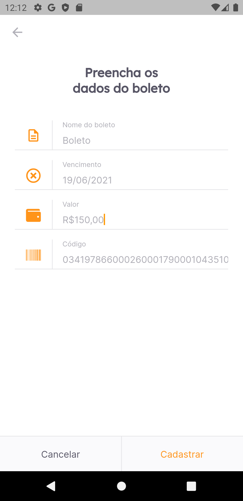

<!-- PROJECT LOGO -->
<br />
<p align="center">

  

  <h3 align="center">Payflow</h3>

  <p align="center">
    Repositório com os arquivos e aplicação "Payflow" desenvolvido durante a "NextLevelWeek 6.0 - Together".
    <br />
  </p>
</p>

<!-- TABLE OF CONTENTS -->
<details open="open">
  <summary>Sumário</summary>
  <ol>
    <li>
      <a href="#sobre-o-projeto">Sobre o Projeto</a>
      <ul>
        <li><a href="#tecnologias-utilizadas">Tecnologias utilizadas</a></li>
        <li><a href="#layout-figma">Figma</a></li>
        <li><a href="#notion">Notion</a></li>
      </ul>
    </li>
    <li><a href="#instalação">Instalação</a></li>
    <li><a href="#licença">Licença</a></li>
  </ol>
</details>

<!-- ABOUT THE PROJECT -->

## Sobre o Projeto

  <p align="center">
  
    
      
  </p>
  </br>

  O App Payflow permite que o usuário adicione e controle seus boletos em um unico lugar. Conta com um scanner de código de barras e também tem a opção de adicioná-lo manualmente através do teclado.

### Tecnologias utilizadas

- [Flutter](https://flutter.dev/)
- [Dart](https://dart.dev/)

### Layout Figma

- [Figma](https://www.figma.com/file/kLK7FYnWKMoN68sQXcSniu/PayFlow?node-id=0%3A1)

### Notion

- [Notion](https://www.notion.so/Mission-Flutter-9d2a1e0818b64b61bc5d9a0424f5c766)

## Instalação

1. Crie um clone desse repo e acesse o diretório clonado.

   ```sh
   git clone https://github.com/paahdiego/NLW-6-Flutter.git

   ou

   git clone git@github.com:paahdiego/NLW-6-Flutter.git
   ```

2. Instalação de dependencias
   ```sh
   flutter pub get
   ```
3. Rodar aplicação
   ```sh
   flutter run
   ```

<!-- LICENSE -->

## Licença

Distributed under the MIT License. See `LICENSE` for more information.
